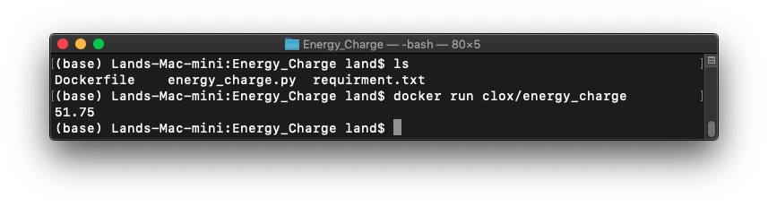

# Energy_Charge
It's a rewritten Energy_Charge project, powered by docker.

There are [macOS version](https://github.com/CLOXnu/Energy_Charge_in_MacOS)

You can use it by typing

```shell
$ docker pull clox/energy_charge
```

to pull this repo. And do type

```shell
$ docker run clox/energy_charge
```

And you can see the amount energy charge of my dormitory.


